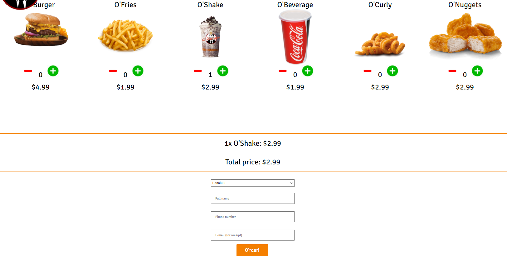
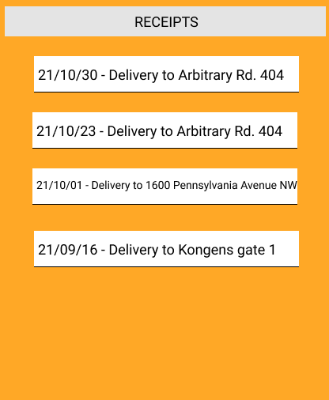
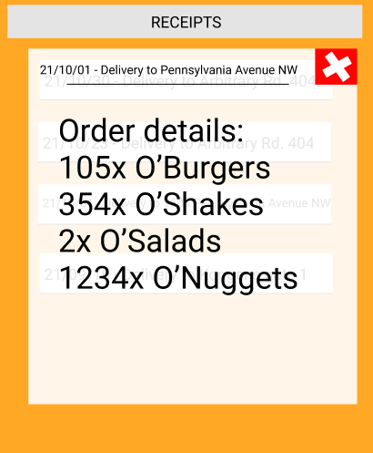

# Description of O'Burger

##  Purpose of the app

O'Burger is an app for ordering food from the O'Burger fast food chain.
The finished product should be able to take orders from the user and store these orders on the cloud.
The user can then view their own orders later.

## Functionalities

By final release we expect to have implemented these functionalities: 
- Create orders by choosing from a variety of menu items, and specifying delivery place
- See receipts of past orders.

## User stories

The following user stories describe in detail what the user should be able to see/do in the app.

### Ordering (us-1)

As a hungry hard-working developer, I crave some quality fast-food.
I want two O'Curlys and one O'Burger delivered to me.

The user needs to be able to order food of their choice (from the menu) and delivery address.

#### The user can see:

- A collection of food they may order (menu)
- Numbers below each dish, corresponding to the quanity that will be ordered (default 0)
- Buttons (+/-) to increase or decrease quantity of these dishes
- Right before confirming order: A "receipt"-preview

#### The user can do:

- Click +/- buttons to change their order contents
- Write delivery address
- "Add order", then "confirm order" after seeing "receipt"

### Viewing previous orders (us-2)

I can't recall if I ordered some vegan food for Jerry, so I may need to buy some vegan food from the store.
I hope there is some way to view the details of my past orders.

The user should be able to view details about their past orders.
This includes everything they specified: food, time, and place.

#### The user can see:

- Receipts of past orders, ordered by time
- When clicking one receipt: Details about that order

#### The user can do:

- Navigate to the order they want to see details about
- They may NOT change past orders

## Example of the app's UI

Image 1: when ordering

Image 2: when viewing receipts

Image 3: when inspecting one receipt:

